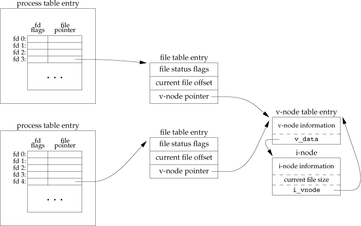

# file I/O

## `open`
```c
#include <fcntl.h>

int open(const char *path, int oflag, ... /* mode_t mode */);
int openat(int fd, const char *path, int oflag, ... /* mode_t mode */);
```

* both return -1 for error.
* always return the lowest-numbered unused descriptor.
* must open with one of the following access mode: `O_RDONLY`, `O_WRONLY`, `O_RDWR`.
* `O_RDONLY`, `O_WRONLY`, `O_RDWR` are defined as 0, 1, and 2. The combination of `O_RDONLY | OWRONLY` does not have the same meaning as `O_RDWR`.
* nonstandard acess mode 3 (binary 11) is used to check for read and write permission on the file and return a descriptor that can't be used for reading or writing.


### flags

* `O_CREAT`
    * create the file if it doesn't exist.
* `O_EXCL`
    * generate an error if `O_CREAT` is also specified and the file already exists.
* `O_NONBLOCK`
    * non-blocking mode for FIFO, block special file or character special file.
* `O_SYNC`
    * have each `write` wait for physical I/O to complete, including updates of file attributes.
    * this call will block the calling process util data has been flushed.
* `O_DSYNC`
    * not wait for updates of file attributes.
    * only flush metadata updates that are required to allow a subsequent read operation to complete sucessfully.
    * Linux actually has `O_DSYNC` same as `O_SYNC`(man page for more detail).
* `O_DIRECT`
    * file I/O is done directly to/from user-space buffers.
* `O_EXCL`
    * ensure this call creates the file.
    * `O_CREAT | O_EXCL`, if pathname already exists, then `open()` will fail.
        * could be used to build a advisory lock.
        * `avocado.utils.filelock.FileLock` is implemented this way.
        * https://github.com/avocado-framework/avocado/blob/master/avocado/utils/filelock.py

### examples

```c
//
// Created by root on 1/3/19.
//

#include <fcntl.h>
#include <stdio.h>
#include <string.h>
#include <unistd.h>
#include <sys/stat.h>
#include <time.h>


int main(void)
{
    char greeting[] = "helloworld\n";
    char filename[] = "./sample.txt";
    int fd0, fd1, fd2, ret;
    struct stat status;
    fd0 = open(filename, O_WRONLY | O_CREAT);
    if ((ret = write(fd0, greeting, strlen(greeting))) == -1)
        perror("write error in first try\n");
    else
        printf("write suceeded in first try\n");
    close(fd0);

    stat(filename, &status);
    printf("modification time: %d\n", status.st_mtim);
    fd1 = open(filename, O_WRONLY | O_APPEND | O_SYNC);
    sleep(1);
    if ((ret = write(fd1, greeting, strlen(greeting))) == -1)
        perror("write error in second try\n");
    else
        printf("write suceeded in second try\n");
    stat(filename, &status);
    printf("modification time after write: %d\n", status.st_mtim);
    close(fd1);
    stat(filename, &status);
    printf("modification time after close: %d\n", status.st_mtim);

    fd2 = open(filename, O_WRONLY | O_APPEND | O_DSYNC);
    sleep(1);
    if ((ret = write(fd2, greeting, strlen(greeting))) == -1)
        perror("write error in third try\n");
    else
        printf("write suceeded in third try\n");
    stat(filename, &status);
    printf("modification time after write: %d\n", status.st_mtim);
    close(fd2);
    sleep(1);
    stat(filename, &status);
    printf("modification time after close: %d\n", status.st_mtim);
    exit(0);
}
```


## `create`

```c
#include <fcntl.h>

int create(const char *path, mode_t mode);
```

`create` is equivalent to:

```c
open(path, OWONLY | O_CREAT | O_TRUNC, mode);
```

## `lseek`

```c
#include "apue.h"
#include <fcntl.h>

char buf0[] = "abcdefghij";
char buf1[] = "ABCDEFGHIJ";


int main(void)
{
    int fd;

    if ((fd = creat("filehole", FILE_MODE)) < 0)
        err_sys("create error");
    if (write(fd, buf0, 10) != 10)
        err_sys("buf0 write error");
    if (lseek(fd, 16384, SEEK_SET) == -1)
        err_sys("lseek error");
    if (write(fd, buf1, 10) != 10)
        err_sys("buf1 write error");
    exit(0);
}
```

```sh
# ls -las filehole
 8 -rw-r--r-- 1 root root 16394 Jan  4 10:52 filehole
# od -c filehole
0000000   a   b   c   d   e   f   g   h   i   j  \0  \0  \0  \0  \0  \0
0000020  \0  \0  \0  \0  \0  \0  \0  \0  \0  \0  \0  \0  \0  \0  \0  \0
*
0040000   A   B   C   D   E   F   G   H   I   J
0040012
```


## `read` && `write`

```c
#include <unistd.h>
ssize_t read(int fd, void *buf, size_t nbytes);
ssize_t write(int fd, void *buf, size_t nbytes);
```

## internal structure



* `lseek` operation only modifies current file offset in the file table entry, no I/O takes place.
* `file descriptor flags` vs `file status flags`
    * `file descriptor flags` apply only to a single descriptor in a single process.
            * `FD_CLOEXEC` specifies that the file descriptor should be closed after the invocation of `exec` function.
    * `file status flags` apply to all descriptors in any process that point to the same file table entry.
* `lseek` vs `O_APPEND`
    * use `lseek(fd, 0L, 2)` could position to EOF, could apply this into appending content to files.
    * for multi-process, use `lseek` to append may lead to confusion(`lseek` and `write` are two separate function calls).
    * better use `O_APPEND`, which is atomic.

## `pread` and `pwrite`
```c
#include <unistd.h>

ssize_t pread(int fd, void *buf, size_t nbytes, off_t offset)
ssize_t pwrite(int fd, void *buf, size_t nbytes, off_t offset)
```

* `pread`
    * same as calling `lseek` followed by `read`, but current file offset is not updated.
* `pwrite`
    * same as calling `lseek` followed by `write`, but current file offset is not updated.

## `dup` and `dup2`

```c
#include <unistd.h>
int dup(int fd);
int dup2(int fd, int fd2);
```

* the new file descriptor shares same file status flags with old file descriptor.
* `dup` always clear `FD_CLOEXEC` for the new file descriptor.

## `sync`, `fsync`, and `fdatasync`

```c
#include <unistd.h>
int fsync(int fd);      // wait for disk writes to complete before returning
int fdatasync(int fd);  // only wait for the data portion

void sync(void);        // queues all the modified block buffers for writing and return
```

* `sync` doesn't guarantee data is flushed to disk.
* `fsync` and `fdatasync` wait till data is flushed to disk.

## `fcntl`

```c
#include <fcntl.h>
int fcntl(int fd, int cmd, .../* int arg */);
```

purposes:
1. `F_DUPFD` or `F_DUPFD_CLOEXEC`.      // duplicate
2. `F_GETFD` or `F_SETFD`.              // descriptor flags
3. `F_GETFL` or `F_SETFL`.              // status flags
4. `F_GETOWN` or `F_SETOWN`.            // asynchronous I/O
5. `F_GETLK`, `F_SETLK` or `F_SETLKW`.  // file lock

### status flags

```c
#include <apue.h>
#include <fcntl.h>

int main(int argc, char *argv[])
{
    int val;
    if (argc != 2)
        err_quit("usage: a.out <descriptor#>");
    if ((val = fcntl(atoi(argv[1]), F_GETFL, 0)) < 0)
        err_sys("fcntl error for fd %d", atoi(argv[1]));
    switch (val & O_ACCMODE)
    {
        case O_RDONLY:
            printf("read only");
            break;
        case O_WRONLY:
            printf("write only");
            break;
        case O_RDWR:
            printf("read write");
            break;
        default:
            err_dump("unknown access mode");
    }
    if (val & O_APPEND)
        printf(", append");
    if (val & O_NONBLOCK)
        printf(", nonblocking");
    if (val & O_SYNC)
        printf(", synchronous writes");
    putchar('\n');
    exit(0);
}
```

#### `fcntl` with `O_SYNC`
Linux ignores `O_SYNC` passed from `fcntl`.
here is a patch trying to fix this: https://lore.kernel.org/patchwork/patch/238610/.
but it seems there is no persuasive reason for Linux to support this: `"so we have no reliable way of signaling to the user that our behaviour here changed."`

```c
#include "apue.h"
#include <fcntl.h>

#define BUFSIZE 4096

void set_fl(int fd, int flags)
{
    int val = 0;
    if ((val = fcntl(fd, F_GETFL, 0)) < 0)
        err_sys("fcntl F_GETFL error");
    val |= flags;
    if (fcntl(fd, F_SETFL, val) < 0)
        err_sys("fcntl F_SETFL error");
}


int main(void)
{
    int n;
    char buf[BUFSIZE];
    set_fl(STDOUT_FILENO, O_SYNC);
    while ((n = read(STDIN_FILENO, buf, BUFSIZE)) > 0)
        if (write(STDOUT_FILENO, buf, n) != n)
            err_sys("write error");
        // fsync(STDOUT_FILENO);
    if (n < 0)
        err_sys("read error");
    exit(0);
}
```

## /dev/fd
```sh
# ls /dev/fd/
0    1    2    255  3
```

## exercises

### 3.2
implement your own `dup2`.

```c
#include <fcntl.h>
#include <unistd.h>
#include <errno.h>
#include "apue.h"


int mydup2(int oldfd, int newfd)
{
    struct stat s;

    if (fstat(oldfd, &s) < 0)
    {
        errno = EBADF;
        return -1;
    }
    int openmax = sysconf(_SC_OPEN_MAX);
    if (newfd < 0 || newfd > openmax)
    {
        errno = EBADF;
        return -1;
    }
    if (oldfd == newfd)
        return newfd;
    if (fstat(newfd, &s) == 0)
        close(newfd);

    // loop to get duplicated descriptor same
    // to newfd
    int index = 0;
    int *allocated = malloc(sizeof(int) * newfd);
    int current;
    int i;
    while (1)
    {
        if ((current = dup(oldfd)) < 0)
            err_sys("dup failed");
        if (current == newfd)
        {
            for (i = 0; i < index; ++i)
                close(allocated[i]);
            free(allocated);
            return newfd;
        }
        else
            allocated[index++] = current;
    }
}


int main(int argc, char *argv[]) {
    int fd0, fd1;
    if (argc != 2)
        err_quit("Usage: %s file", argv[0]);
    if ((fd0 = open(argv[1], O_RDONLY)) < 0)
        err_sys("can't open file %s", argv[1]);
    fd1 = mydup2(fd0, 100);
    printf("%d\n", fd1);
}
```


### 3.4
```c
dup2(fd, 0);
dup2(fd, 1);
dup2(fd, 2);
if (fd > 2);
    close(fd);
```

`dup2(fd, fd2)`:
* if `fd2` is already open, it is first closed.
* if `fd` equals `fd2`, `dup2` returns `fd2` without closing it.

You don't want to leave any unused file descriptors open. After you redirect `stdin`, `stdout`, and `stderr` to `fd`, you're not planning on using fd by itself -- it was just opened temporarily so that you could then duplicate all the standard descriptors to it. So you need to close it.
https://stackoverflow.com/questions/46206188/usage-of-dup2

## 3.5
```
digit1 >&digit2     // redirect descriptor digit1 to the same file as digit2
```

```
# ./a.out > outfile 2>&1        // both 1, 2 point to the  outfile
# ./a.out 2>&1 > outfile        // 1 set to the outfile, 2 set to the terminal
```

# reference
https://lwn.net/Articles/350219/
http://man7.org/linux/man-pages/man2/open.2.html
https://stackoverflow.com/questions/26014185/how-to-synchronize-a-file-move-to-storage
