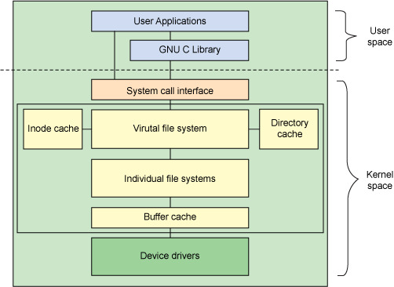
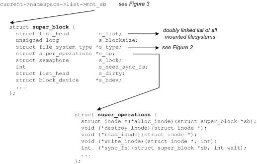
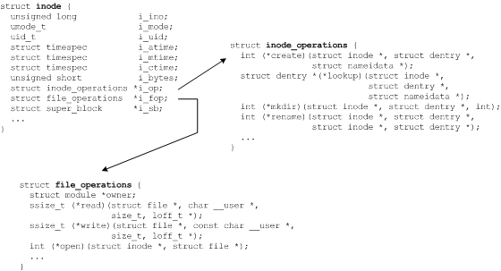
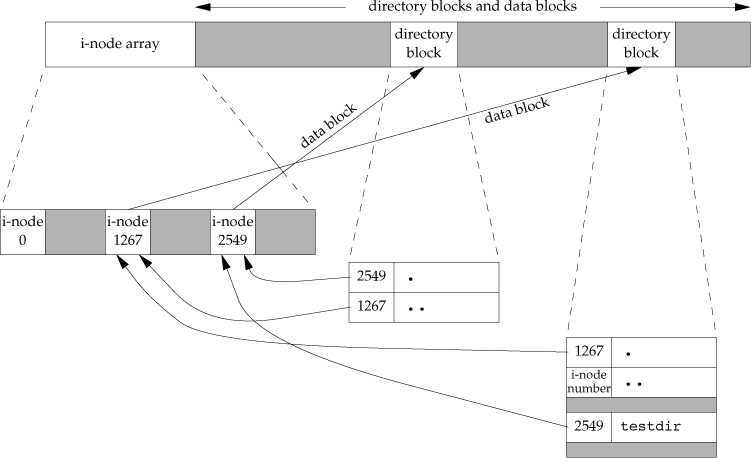

# files and directories

## stat, fstat, fstatat, and lstat

```c
#include <sys/stat.h>

int stat(const char *restrict pathname, struct stat *restrict buf);
int fstat(int fd, struct stat *buf);
int lstat(const char *restricted pathname, struct stat *restrict buf);
int fstatat(int fd, const char *restrict pathname, struct stat *restrict buf, int flag);
```

* `stat` returns statistics over a file specified by `pathname`
* `fstat` returns statistics over a file descriptor.
* `lstat` returns statistics over the symbolic link.
* `fstatat` returns stat for a `pathname` relative to an open directory represented by `fd`.


## struct stat

```c
struct stat {
    dev_t     st_dev;         /* ID of device containing file */
    ino_t     st_ino;         /* Inode number */
    mode_t    st_mode;        /* File type and mode */
    nlink_t   st_nlink;       /* Number of hard links */
    uid_t     st_uid;         /* User ID of owner */
    gid_t     st_gid;         /* Group ID of owner */
    dev_t     st_rdev;        /* Device ID (if special file) */
    off_t     st_size;        /* Total size, in bytes */
    blksize_t st_blksize;     /* Block size for filesystem I/O */
    blkcnt_t  st_blocks;      /* Number of 512B blocks allocated */

    /* Since Linux 2.6, the kernel supports nanosecond
       precision for the following timestamp fields.
       For the details before Linux 2.6, see NOTES. */

     struct timespec st_atim;  /* Time of last access */
     struct timespec st_mtim;  /* Time of last modification */
     struct timespec st_ctim;  /* Time of last status change */

     #define st_atime st_atim.tv_sec      /* Backward compatibility */
     #define st_mtime st_mtim.tv_sec
     #define st_ctime st_ctim.tv_sec
};
```

### file types

* regular file
    * `S_ISREG`
* directory
    * `S_ISDIR`
* block device - buffered I/O
    * `S_ISBLK`
* character device - unbuffered I/O
    * `S_ISCHR`
* FIFO
    * `S_ISFIFO`
* socket
    * `S_ISSOCK`
* symbolic link
    * `S_ISLINK`

### setuid, setgid, sticky bit

#### setuid
if an executable is set with `setuid`, when it is launched, it doesn't run with the priviledge of the user who launched it, but with file owner.
only has effect on files.

```sh
# ls -la /bin/passwd
-rwsr-xr-x. 1 root root 27832 Jan 30  2014 /bin/passwd
```

#### setgid

* if used on file, file is executed with the priviledge of file owner instead of the launcher.
* if used on directory, created file will have group same as the directory instead of the owner.
    * could be used in shared directory

#### sticky bit
* only has effect on directory.
* all files within sticky-bit-set directory will be only modifiable by their owners.
    * could not be removed/modified by the directory owner.

### file access permissions
|`st_mode` mask|meaning|
|:-------:|:---------:|
|`S_IRUSR`||
|`S_IWUSR`||
|`S_IXUSR`||
|`S_IRGRP`||
|`S_IWGRP`||
|`S_IXGRP`||
|`S_IROTH`||
|`S_IWOTH`||
|`S_IXOTH`||

#### file and directory access rules
* `r` on directory lets us read the directory and obtain a list of all the filenames in the directory.
* `x` on directory lets us pass through the directory when it is a component of a pathname that we are trying to access.
* whenever we want to open any type of file by name, we must have execute permission in each directory mentioned in the name, including current working directory.
* to create/modify/delete files, we must have write and execute permission.

#### file access test

1. if effective user ID of the process is 0, access is allowed.
2. if effective user ID matches the owner ID of the file, access is allowed if appropriate user access permission bit is set.
3. if effective group ID matches or one of the supplementary group IDs of the process matches the group ID of the file, access is allowed if appropriate group access permission bit is set.
4. if appropriate other access permission bit is set, access is allowed, otherwise denied.


### ownership of new files and directories
* rules applied to files are same to directories.
* group ID of new files:
    1. group ID could be the effective group ID of the process.
    2. group ID could be the group ID of the directory. (`setgid`)


### check access test based on real user and group IDs
```c
#include <unistd.h>
int access(const char *pathname, int mode);
int faccessat(int fd, const char *pathname, int mode, int flag);
```
|`mode` mask|meaning|
|:-------:|:---------:|
|`R_OK`||
|`W_OK`||
|`X_OK`||

### umask
`umask` is used by `open`, `create` and other system calls that create files to modify the permission placed on newly created files or directories, specifically, permissions in the umask are turned off from the mode argument to `open` and `create`.
`umask` returns the previous value of the mask.
```sh
# umask -S          // symblic form, display which permissions are allowed.
u=rx,g=rwx,o=rwx
```

```c
#include "apue.h"
#include <unistd.h>
#include <fcntl.h>


#define RWRWRW (S_IRUSR | S_IWUSR | S_IRGRP | S_IWGRP | S_IROTH | S_IWOTH)

int main(void)
{
    umask(0);
    if (creat("foo", RWRWRW) < 0)
        err_sys("create error for foo");
    umask(S_IRGRP | S_IWGRP | S_IROTH | S_IWOTH);
    if (creat("bar", RWRWRW) < 0)
        err_sys("create error for bar");
    exit(0);
}
```

The effective permissions are modified by the process's umask in the usual way:  The  permissions  of  the  created  file are (mode & ~umask).  Note that this mode applies only to future accesses of the newly created file; the open() call that  creates a read-only file may well return a read/write file descriptor.

### change access permission
```c
#include <sys/stat.h>
int chmod(const char *pathname, mode_t mode);
int fchmod(int fd, mode_t mode);
int fchmodat(int fd, const char *pathname, mode_t mode, int flag);
```

* `setgid` on directory: file created within directory has same gid as directory gid.
* `sticky bit` on directory: prevents unprivileged users from removing or renaming a file in the directory unless they own the file or the directory
    * note: file directory owner still have the right to delete/modify file no matter who creates.
    * a file in the directory can be removed or renamed only if the user has write permission for the directory and meet one of the following criteria:
        1. file owner.
        2. directory owner.
        3. superuser.
* `chmod` automatically clear `setgid` if:
    * if the gid of the new file doesn't equal to either the effective gid of process or one of the prcess's supplementary group IDs and the process doesn't have superuser privileges.
    * this prevents a user from creating a set-group-ID file owned by a group the user doesn't belong to.


```sh
$ mkdir demo
$ chmod g+s demo
$ stat demo
  File: ‘demo’
  Size: 6         	Blocks: 0          IO Block: 4096   directory
Device: fd02h/64770d	Inode: 272552367   Links: 2
Access: (2755/drwxr-sr-x)  Uid: ( 1000/   lolyu)   Gid: ( 1000/   lolyu)
Access: 2019-01-08 11:23:51.756413120 +0800
Modify: 2019-01-08 11:23:51.756413120 +0800
Change: 2019-01-08 11:24:00.833204727 +0800
 Birth: -
# > file
# ls -la file
-rw-r--r-- 1 root lolyu 0 Jan  8 11:25 file             // the group is set to be same as directory gid
```


```sh
# chmod o+t demo                                        // set the sticky bit
```

```sh
# stat demo
  File: ‘demo’
  Size: 18        	Blocks: 0          IO Block: 4096   directory
Device: fd02h/64770d	Inode: 272552367   Links: 2
Access: (3755/drwxr-sr-t)  Uid: ( 1000/   lolyu)   Gid: ( 1000/   lolyu)    // s for both setgid and group execute bit
Access: 2019-01-08 11:25:24.270289105 +0800
Modify: 2019-01-08 11:25:14.958502894 +0800
Change: 2019-01-08 11:32:08.231988088 +0800
 Birth: -
# chmod g-x demo
# stat demo
  File: ‘demo’
  Size: 18        	Blocks: 0          IO Block: 4096   directory
Device: fd02h/64770d	Inode: 272552367   Links: 2
Access: (3745/drwxr-Sr-t)  Uid: ( 1000/   lolyu)   Gid: ( 1000/   lolyu)    // S for only setgid without group execute bit
Access: 2019-01-08 11:25:24.270289105 +0800
Modify: 2019-01-08 11:25:14.958502894 +0800
Change: 2019-01-08 11:34:29.501708030 +0800
 Birth: -

```

### file size
`st_size`:
* stores the size of file in bytes.
* for symbolic link, it stores the number of bytes in the linking filename.

```sh
# ls -la link*
lrwxrwxrwx 1 root root 17 Jan 10 14:21 link0 -> /home/test/cml.sh
lrwxrwxrwx 1 root root  6 Jan 10 14:21 link1 -> cml.sh
lrwxrwxrwx 1 root root  6 Jan 10 14:18 link.sh -> cml.sh
# du link*
0	link0
0	link1
0	link.sh
```

`st_blksize`:
prefered block size for I/O for the file.


`st_blocks`:
actual number of 512-byte blocks allocated.


#### holes in file

https://wiki.archlinux.org/index.php/sparse_file
https://bugzilla.kernel.org/show_bug.cgi?id=80981


```c
# truncate -s 512M file.img
# ls -l file.img
-rw-r--r-- 1 root root 536870912 Jan 10 14:46 file.img
# du -h file.img
0M	file.img
# du  file.img
0	file.img
```

from `man du`:
Display  values  are  in  units  of  the  first  available  SIZE  from  --block-size,  and  the DU_BLOCK_SIZE,  BLOCK_SIZE  and  BLOCKSIZE  environment variables.  Otherwise, units default to 1024 bytes (or 512 if POSIXLY_CORRECT is set).

##### making existing file sparse
```c
# cp file.img copy.img --sparse=never
# du -h copy.img
512M	copy.img
# fallocate -d copy.img
# du -h copy.img
0	copy.img
```


##### copy sparse file
```
# truncate file --size 1G
# ls -la file
--w-r--r-- 1 lolyu lolyu 1073741824 Jan 17 16:14 file
# du -h file
0	file
# cp file file1
# du -h file file1
0	file
0	file1
# cp --sparse=never file file1
  cp: overwrite ‘file1’? y
# du -h file file1
  0	file
  1.0G	file1
```

## file system
file system is an organization of data and metadata on a storage device.

### whole picture


buffer cache maintained a buffer list that buffers requests between the file systems and the block devices that they manipulated. It is managed as a set of LRU lists.

check supported file system:
```sh
# cat /proc/filesystems
nodev	sysfs
nodev	rootfs
nodev	ramfs
nodev	bdev
nodev	proc
nodev	cgroup
nodev	cpuset
nodev	tmpfs
nodev	devtmpfs
nodev	debugfs
nodev	securityfs
nodev	sockfs
nodev	dax
nodev	bpf
nodev	pipefs
nodev	anon_inodefs
nodev	configfs
nodev	devpts
nodev	hugetlbfs
nodev	autofs
nodev	pstore
nodev	mqueue
nodev	rpc_pipefs
	xfs
nodev	nfsd
nodev	overlay
nodev	nfs
nodev	nfs4
	fuseblk
nodev	fuse
nodev	fusectl

```

### super block

`super block` is essentially file system metadata and defines the file system.
### inode


### dentry
`dentry` stores the filename, related inode number, the length of filename and the length of directory record.

every subdirectory in a parent directory causes the parent directory's link count to be increased by 1.

```sh
# mkdir testdir
```


the directory link count:
`link = dot (.) + count of child directories (..) + entry to this directory`

### link, unlink, linkat, unlinkat and remove
```c
#include <unistd.h>
int link(const char *existingpath, const char *newpath);
int linkat(int efd, const char *existingpath, int nfd, const char *newfd, int flag);
int unlink(const char *pathname);
int unlinkat(int fd, const char *pathname, int flag);
int remove(const char *pathname);
```

* `link`
    * hard links cannot span file systems.
    * if `existingpath` is a symbolic link, the new link is created as a hard link to the symbolic link file(`newpath` becomes symbolic link to the same file that `existingpath` points to).
* `linkat`
    * support following flags:
        * `AT_EMPTY_PATH`
        * `AT_SYMLINK_FOLLOW`
            * dereference `oldpath` if it is a symbolic link
* `unlink`
    * delete a name from the file system, if the name was the last link and no process have open the file, the space it was using is made available for reuse.
    * must have write and execute permission.
        * if sticky bit is set:
            * must be one of:
                * file owner
                * directory owner
                * root

```c
#include "apue.h"
#include <fcntl.h>


int main(int argc, char **argv)
{
    if (open("tempfile", O_RDWR) < 0)
        err_sys("open error");
    if (unlink("tempfile") < 0)
        err_sys("unlink error");
    printf("file unlinked\n");
    sleep(15);
    printf("done\n");
    exit(0);
}
```
To ensure a temporary file created won't be left around, call `open` then `unlink`.

### rename
```c
#include <stdio.h>
int rename(const char *oldname, const char *newname);
int renameat(int oldfd, const char *oldname, int newfd, const char *newname);
```

### symbolic links

#### symbolic vs hard
|symbolic|hard|
|--------|---------|
|link and file must be on the same file system||
|only superuser could create||

#### treatment of symbolic links by various functions
|function|not follow|follow|python equivalent|
|:--------:|:-:|:-:|:-:|
|access||*|os.access|
|chdir||*|os.chdir|
|chmod||*|os.chmod|
|chown||*|os.chown|
|creat||*||
|exec||*||
|lchown|*||os.lchown|
|link||*|os.link|
|lstat|*||os.lstat|
|open||*|os.oepn|
|opendir||*||
|pathconfig||*||
|readlink|*|||
|remove|*||os.remove|
|rename|*||os.rename|
|stat||*|os.stat|
|truncate||*|os.truncate|
|unlink|*||os.unlink|

#### show symbolic link
```sh
# ls -l mylink              // starts with lrw, l means symbolic
lrwxrwxrwx 1 root root 9 Jan 11 13:14 mylink -> /etc/asda
# ls -F mylink              // appending a '@' to the end of symbolic link
mylink@
```

#### related functions

```c
#include <unistd.h>

int symlink(const char* actualpath, const char *sympath);
int symlinkat(const char* actualpath, int fd, const char *sympath);
ssize_t readlink(const char *restrict pathname, char* restrict buf, size_t bufsize);
ssize_t readlinkat(int fd, const char* restrict pathname, char* restrict buf, size_t bufsize);
```


## file time
|field|description|ls|
|:-------:|:-------:|:------:|
|st_atim|last access time of file data||
|st_mtim|last modification time of file data||
|st_ctim|last change time of inode status||

* `st_mtim` refers to last time the content is modified.
* `st_ctim` refers to last time the inode of file was change(metadata).:
* system doesn't maintain the last-access time for inode, so `access` and `stat` won't change `st_atim`


### ls

```c
# ls -l                         // default with modification time
total 28
-rw-------. 1 root root 10973 Dec 20 02:36 anaconda-ks.cfg
drwxr-xr-x. 3 root root    25 Dec 22 19:51 avocado
-rw-r--r--. 1 root root   512 Jan 10 03:02 file
-rw-------. 1 root root 11829 Dec 20 02:36 original-ks.cfg
# ls -lc                        // change time
total 28
-rw-------. 1 root root 10973 Dec 20 02:36 anaconda-ks.cfg
drwxr-xr-x. 3 root root    25 Dec 22 19:51 avocado
-rw-r--r--. 1 root root   512 Jan 10 03:02 file
-rw-------. 1 root root 11829 Dec 20 02:36 original-ks.cfg
# ls -lu                        // access time
total 28
-rw-------. 1 root root 10973 Dec 28 21:10 anaconda-ks.cfg
drwxr-xr-x. 3 root root    25 Jan 16 00:34 avocado
-rw-r--r--. 1 root root   512 Jan 10 02:56 file
-rw-------. 1 root root 11829 Dec 20 02:36 original-ks.cfg
```


## mkdir, mkdirat and rmdir
```c
#include <sys/sys.h>
int mkdir(const char *pathname, mode_t mode);
int mkdirat(int fd, const char *pathname, mode_t mode);
```

## reading directories
```c
//
// Created by root on 1/17/19.
//

#include "apue.h"
#include <dirent.h>
#include <limits.h>

// #define NAME_MAX         255	/* # chars in a file name */
// #define PATH_MAX        4096	/* # chars in a path name including nul */

typedef int Myfunc(const char *, const struct stat *, int);

// static function variable keeps value between invocations
// static global value is seen only in the file it's declared in
static Myfunc myfunc;
static int myftw(char *, Myfunc *);
static int dopath(Myfunc *);

static long nreg, ndir, nblk, nchr, nfifo, nslink, nsock, ntot;

int main(int argc, char *argv[])
{
    int ret;
    if (argc != 2)
        err_quit("usage: ftw <starting-pathname>");
    ret = myftw(argv[1], myfunc);
    ntot = nreg + ndir + nblk + nchr + nfifo + nslink + nsock;
    if (ntot == 0)
        ntot = 1;
    printf("regular files = %7ld, %5.2f %%\n", nreg, nreg * 100.0 / ntot);
    printf("directories = %7ld, %5.2f %%\n", ndir, ndir * 100.0 / ntot);
    printf("block special = %7ld, %5.2f %%\n", nblk, nblk * 100.0 / ntot);
    printf("char special = %7ld, %5.2f %%\n", nchr, nchr * 100.0 / ntot);
    printf("FIFOs = %7ld, %5.2f %%\n", nfifo, nfifo * 100.0 / ntot);
    printf("symbolic links = %7ld, %5.2f %%\n", nslink, nslink * 100.0 / ntot);
    printf("sockets = %7ld, %5.2f %%\n", nsock, nsock * 100.0 / ntot);
    exit(ret);
}

#define FTW_F   1   // file other than dir
#define FTW_D   2   // dir
#define FTW_DNR 3   // directory can't read
#define FTW_NS  4   // file can't stat

static char *fullpath;
static size_t pathlen;

static int myftw(char *pathname, Myfunc *func)
{
    fullpath = path_alloc(&pathlen);
    if (pathlen <= strlen(pathname))
    {
        pathlen = strlen(pathname) * 2;
        if ((fullpath = realloc(fullpath, pathlen)) == NULL)
            err_sys("realloc failed");
    }
    strcpy(fullpath, pathname);
    return(dopath(func));
}

static int dopath(Myfunc *func)
{
    struct stat     statbuf;
    struct dirent   *dirp;
    DIR             *dp;
    int             ret, n;
    if (lstat(fullpath, &statbuf) < 0)
        return(func(fullpath, &statbuf, FTW_NS));
    if (S_ISDIR(statbuf.st_mode) == 0)
        return(func(fullpath, &statbuf, FTW_F));
    if ((ret = func(fullpath, &statbuf, FTW_D)) != 0)
        return(ret);
    n = strlen(fullpath);
    if (n + NAME_MAX + 2 > pathlen)
    {
        pathlen *= 2;
        if ((fullpath = realloc(fullpath, pathlen)) == NULL)
            err_sys("realloc failed");
    }
    fullpath[n++] = '/';
    fullpath[n] = 0;
    if ((dp = opendir(fullpath)) == NULL)
        return(func(fullpath, &statbuf, FTW_DNR));
    while ((dirp = readdir(dp)) != NULL)
    {
        if (strcmp(dirp->d_name, ".") == 0 || strcmp(dirp->d_name, "..") == 0)
            continue;
        strcpy(&fullpath[n], dirp->d_name);
        if ((ret = dopath(func)) != 0)
            break;
    }
    fullpath[n - 1] = 0;
    if (closedir(dp) < 0)
        err_ret("can't close directory %s", fullpath);
    return(ret);
}

static int myfunc(const char *pathname, const struct stat *statptr, int type)
{
    switch (type)
    {
        case FTW_F:
            // S_IFMT is a bit mask for file type
            // stat.st_mode & S_IFMT to determine file type
            // stat.st_mode & ~S_IFMT to determine file permissions(other than file type)
            switch (statptr->st_mode & S_IFMT)
            {
                case S_IFREG: ++nreg;       break;
                case S_IFBLK: ++nblk;       break;
                case S_IFCHR: ++nchr;       break;
                case S_IFIFO: ++nfifo;      break;
                case S_IFLNK: ++nslink;     break;
                case S_IFSOCK: ++nsock;     break;
                case S_IFDIR:
                    err_dump("for S_IFDIR for %s", pathname);
            }
            break;
        case FTW_D:
            ++ndir;
            break;
        case FTW_DNR:
            err_ret("can't read directory %s", pathname);
            break;
        case FTW_NS:
            err_ret("stat error for %s", pathname);
            break;
        default:
            err_dump("unknown type %d for pathname %s", type, pathname);
    }
    return(0);
}
```

## working directory

```c
#include <unistd.h>
int chdir(const char *pathname);
int fchdir(int fd);
```

* current working directory is an attribute of a process.


## device number
* major and minor device number
    * a disk often contains serveral file systems.
        * each file system have same major number but different minor number.
* `st_dev`
    * ID of device containing this file
* `st_rdev`: only for character special files or block special files
    * device ID for the actual device

## exercises

### 4.1
follow symbolic links

### 4.2
permission "---------"

### 4.3
```
 ~  > file
 ~  cat file
 ~  ls -l file
-rw-r--r-- 1 lolyu lolyu 0 Jan 17 16:02 file
 ~  chmod u-r file
 ~  cat file
cat: file: Permission denied

```

### 4.5
symbolic links should not have 0 file size.

### 4.6
check `7-mycp.c`

### 4.7

### 4.8
after the call to unlink, the file no longer exists.
* `du` summarizes disk usage of each FILE, recursively for directories.
    * after unlink, the file no longer exists, `du` will directly show the change that available space on disk increases.
    * `du` reports on `object` level.
* `df` shows information about the file system on which each FILE resides.
    * `df` gets most of its information from filesystem's superblock.
    * `df` reports on `filesystem/mountpoint` level.

### 4.9
change inode link count.

### 4.10
limit the depth of recursion.

### 4.11
checkout `10-list.c`
It runs much faster.

### 4.12
`chroot` jails process to subdirectories other than `/`.q

### 4.15
`ctime`: won't be saved, it is the change status of inode, could not restore.
`mtime`: could be saved.
`atime`: always the extraction time.


### 4.17
```sh
ls /dev/fd/ -l
total 0
lrwx------ 1 root root 64 Jan 18 14:12 0 -> /dev/pts/2
lrwx------ 1 root root 64 Jan 18 14:12 1 -> /dev/pts/2
lrwx------ 1 root root 64 Jan 18 14:12 2 -> /dev/pts/2
lr-x------ 1 root root 64 Jan 18 14:12 3 -> /proc/22527/fd

```

# references
https://www.ibm.com/developerworks/library/l-linux-filesystem/index.html
http://linuxshellaccount.blogspot.com/2008/12/why-du-and-df-display-different-values.html
